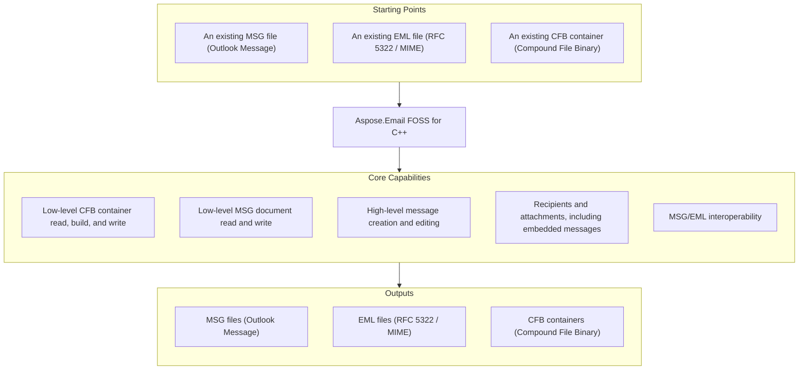

# Aspose.Email FOSS for C++

[](LICENSE) [](CMakeLists.txt)

[](https://products.aspose.org/email/cpp/)

Aspose.Email FOSS for C++ is a C++17 library for reading and writing binary email containers and
messages — Compound File Binary (CFB) containers, Outlook MSG documents, and RFC 5322 / MIME EML
files — with deterministic, byte-level output and no third-party library dependency of its own. It
exposes both a low-level container API (`cfb_reader`/`cfb_writer`,
`msg_reader`/`msg_document`/`msg_writer`) for direct structural access and a high-level
`mapi_message` API for creating, editing, and reloading messages.

## Navigation

- [At a Glance](#at-a-glance)
- [Key Capabilities](#key-capabilities)
- [Installation](#installation)
- [Dependencies](#dependencies)
- [Quick Start](#quick-start)
- [Additional Examples](#additional-examples)
- [API Reference](#api-reference)
- [Documentation & Resources](#documentation--resources)
- [Scope and Limitations](#scope-and-limitations)
- [Development and Testing](#development-and-testing)
- [License](#license)

## At a Glance



## Key Capabilities

- **Low-level CFB access** — read, build, and write generic Compound File Binary containers
  directly through `cfb_reader`, `cfb_storage`/`cfb_stream`, and `cfb_writer`, working with file
  paths, in-memory streams, or raw byte buffers.
- **Low-level MSG document model** — parse and reconstruct the raw MSG directory/stream structure
  with `msg_reader`, `msg_document`, and `msg_writer`, including an optional strict-validation mode
  surfaced through `validation_issues()`.
- **High-level message authoring** — create, edit, save, and reload Outlook-style messages through
  `mapi_message`, setting the subject, plain-text and HTML bodies, and sender identity, or reaching
  arbitrary MAPI properties via `set_property()`/`get_property_value()` with
  `common_message_property_id` and `property_type_code`.
- **Recipients and attachments** — add To/Cc/Bcc recipients with `add_recipient()`, attach regular
  files from byte buffers or streams with `add_attachment()`, and nest a full `mapi_message` as an
  embedded-message attachment with `add_embedded_message_attachment()`.
- **MSG/EML interoperability** — save an in-memory `mapi_message` to `.eml` and load `.eml` back
  into a `mapi_message`, both through the library's own MIME engine, with no external MIME
  dependency.

## Installation

No NuGet package has been published for this library yet — build it from source with CMake and
either add it as a subdirectory of your own build, or install it and consume it with
`find_package(AsposeEmailFoss)`.

```cmake
add_subdirectory(Aspose.Email-FOSS-for-Cpp)
target_link_libraries(your_app PRIVATE AsposeEmailFoss::AsposeEmailFoss)
```

### Build

```powershell
cmake --preset default
cmake --build --preset default
ctest --preset default
```

This uses the repo's own `CMakePresets.json` "default" configuration (Ninja generator,
`RelWithDebInfo`, tests on, examples off). The library target is `AsposeEmailFoss` (alias
`AsposeEmailFoss::AsposeEmailFoss`); no third-party dependency is fetched to build or test it.

### Install (Optional)

```powershell
cmake --install out\build\default --prefix out\install\default
```

This installs the headers plus a CMake package config (`AsposeEmailFossConfig.cmake`) under the
given prefix, so a downstream project can consume the library with `find_package(AsposeEmailFoss)`
instead of vendoring the source tree.

## Dependencies

### Required Package Dependencies

No required third-party package dependencies.

### Native and System Requirements

- CMake 3.26 or later — the version floor set by the project's own `cmake_minimum_required`.
- A C++17 compiler — the library target sets `CMAKE_CXX_STANDARD 17` with
  `CMAKE_CXX_STANDARD_REQUIRED ON`.
- Ninja — the generator configured by the repository's own `default` CMake preset
  (`CMakePresets.json`); any CMake-supported generator works if you configure the project directly
  instead of through that preset.

## Quick Start

Read a subject from an MSG file opened as a binary stream:

```cpp
#include <fstream>
#include <iostream>

#include "aspose/email/foss/msg/mapi_message.hpp"

int main()
{
    std::ifstream input("sample.msg", std::ios::binary);
    auto message = aspose::email::foss::msg::mapi_message::from_stream(input);
    std::cout << message.subject() << '\n';
}
```

Create a message and save it as both MSG and EML:

```cpp
#include <fstream>

#include "aspose/email/foss/msg/mapi_message.hpp"

int main()
{
    auto message = aspose::email::foss::msg::mapi_message::create("Hello", "Body");
    message.set_sender_name("Alice");
    message.set_sender_email_address("alice@example.com");
    message.add_recipient("bob@example.com", "Bob");
    message.add_attachment("note.txt", std::vector<std::uint8_t>{'a', 'b', 'c'}, "text/plain");

    std::ofstream msg_output("hello.msg", std::ios::binary);
    message.save(msg_output);

    std::ofstream eml_output("hello.eml", std::ios::binary);
    message.save_to_eml(eml_output);
}
```

For a full command-line workflow, see
[`examples/create_msg_and_eml.cpp`](examples/create_msg_and_eml.cpp),
[`examples/msg_reader.cpp`](examples/msg_reader.cpp), and
[`examples/msg_summary.cpp`](examples/msg_summary.cpp) under
[Additional Examples](#additional-examples) below.

## Additional Examples

Runnable CLI examples live in the [`examples/`](examples/) directory — turn on
`ASPOSE_EMAIL_FOSS_BUILD_EXAMPLES` to build them (see
[Development and Testing](#development-and-testing)); [`examples/README.md`](examples/README.md)
maps each one to the specific API calls it exercises.

### Create a Message and Save Both MSG and EML From the Command Line

```cpp
int main(int argc, char* argv[])
{
    const auto msg_path = read_option(argc, argv, "--msg-path", "example-message.msg");
    const auto eml_path = read_option(argc, argv, "--eml-path", "example-message.eml");

    auto message = aspose::email::foss::msg::mapi_message::create(
        "Quarterly status update and rollout plan",
        "Hello team,\n\nPlease find the latest rollout summary attached.\n\nRegards,\nEngineering");

    message.set_property(
        to_underlying(aspose::email::foss::msg::common_message_property_id::sender_name),
        to_underlying(aspose::email::foss::msg::property_type_code::ptyp_string),
        std::string("Build Agent"));
    message.set_property(
        to_underlying(aspose::email::foss::msg::common_message_property_id::sender_email_address),
        to_underlying(aspose::email::foss::msg::property_type_code::ptyp_string),
        std::string("build.agent@example.com"));
    message.set_property(
        to_underlying(aspose::email::foss::msg::common_message_property_id::internet_message_id),
        to_underlying(aspose::email::foss::msg::property_type_code::ptyp_string),
        std::string("<example-message-001@example.com>"));
    message.set_property(
        to_underlying(aspose::email::foss::msg::common_message_property_id::display_to),
        to_underlying(aspose::email::foss::msg::property_type_code::ptyp_string),
        std::string("Alice Example; Bob Example"));
    message.set_property(
        to_underlying(aspose::email::foss::msg::common_message_property_id::display_cc),
        to_underlying(aspose::email::foss::msg::property_type_code::ptyp_string),
        std::string("Carol Example"));
    message.set_property(
        to_underlying(aspose::email::foss::msg::common_message_property_id::display_bcc),
        to_underlying(aspose::email::foss::msg::property_type_code::ptyp_string),
        std::string("Ops Archive"));
    message.set_property(
        to_underlying(aspose::email::foss::msg::common_message_property_id::transport_message_headers),
        to_underlying(aspose::email::foss::msg::property_type_code::ptyp_string),
        std::string("X-Environment: example\r\nX-Workflow: create-msg-and-eml\r\n"));

    message.add_recipient("alice@example.com", "Alice Example");
    message.add_recipient("bob@example.com", "Bob Example");
    message.add_recipient("carol@example.com", "Carol Example", aspose::email::foss::msg::mapi_message::recipient_type_cc);
    message.add_recipient("archive@example.com", "Ops Archive", aspose::email::foss::msg::mapi_message::recipient_type_bcc);

    message.add_attachment("hello.txt", std::vector<std::uint8_t> {'s', 'a', 'm', 'p', 'l', 'e', ' ', 'a', 't', 't', 'a', 'c', 'h', 'm', 'e', 'n', 't', '\n'}, "text/plain");
    message.add_attachment("report.bin", std::vector<std::uint8_t> {0x00, 0x01, 0x02, 0x03, 0x04, 0x05}, "application/octet-stream");
    message.save(std::filesystem::path(msg_path));

    auto loaded_message = aspose::email::foss::msg::mapi_message::from_file(std::filesystem::path(msg_path));
    loaded_message.save_to_eml(std::filesystem::path(eml_path));

    std::cout << "MSG saved to: " << msg_path << '\n';
    std::cout << "EML saved to: " << eml_path << '\n';
    return 0;
}
```

`read_option()` (command-line argument parsing) and `to_underlying()` (enum-to-underlying-type
cast) are small helpers defined earlier in the same file,
[`examples/create_msg_and_eml.cpp`](examples/create_msg_and_eml.cpp) — this excerpt is its
`main()`.

<details>
<summary>View Additional Examples</summary>

### Inspect Low-Level MSG and CFB Structure

```cpp
int main(int argc, char* argv[])
{
    if (argc < 2)
    {
        std::cerr << "Usage: msg_reader.cpp <path-to-msg> [--out <path>]\n";
        return 1;
    }

    const std::filesystem::path msg_path(argv[1]);
    const auto out_path = read_option(argc, argv, "--out");

    const auto reader = aspose::email::foss::msg::msg_reader::from_file(msg_path);
    const auto document = aspose::email::foss::msg::msg_document::from_reader(reader);
    const auto dump = build_dump(reader, document, msg_path);

    if (!out_path.empty())
    {
        std::ofstream output(out_path, std::ios::binary);
        output << dump;
    }
    else
    {
        std::cout << dump << '\n';
    }

    return 0;
}
```

`build_dump()` is a formatting helper defined earlier in the same file,
[`examples/msg_reader.cpp`](examples/msg_reader.cpp), that walks the `msg_reader`/`msg_document`
pair and renders their CFB directory/stream structure as text.

[`examples/msg_summary.cpp`](examples/msg_summary.cpp) is a third example worth knowing about: it
opens a `.msg` file through `mapi_message` and prints a high-level summary — subject, sender,
recipients, attachments, and a body preview — including looking up an arbitrary MAPI property by
ID and type when `--property-id`/`--property-type` are passed on the command line. Its `main()` is
longer than is useful to reproduce here; see the file directly.

</details>

## API Reference

`mapi_message` is the primary high-level entry point for creating, editing, and reloading
messages; the lower-level `msg_reader`/`msg_document`/`msg_writer` and
`cfb_reader`/`cfb_document`/`cfb_writer` classes expose the underlying MSG and CFB container
structure directly for callers that need it.

<details>
<summary>View the Full API Surface</summary>

### Foss

| Class | Description |
|---|---|
| `cfb_document` | Mutable Compound File Binary (CFB) document — holds the root `cfb_storage` tree and header fields (major/minor version, transaction signature number); built via `from_reader`/`from_file`/`from_stream`/`from_bytes`/`from_buffer`. |
| `cfb_exception` | Exception type thrown for malformed or unsupported Compound File Binary (CFB) content (a `std::runtime_error` subclass). |
| `cfb_node` | Abstract base class for CFB tree nodes (`cfb_storage` or `cfb_stream`) — carries name, CLSID, state bits, and creation/modified timestamps common to both. |
| `cfb_reader` | Reusable reader for parsed Compound File Binary (CFB) containers — exposes the header, FAT/mini-FAT/DIFAT chains, and directory entries, and resolves storage/stream data by ID or path. |
| `cfb_storage` | Mutable CFB storage node — a directory-like container of child nodes (nested storages and streams), built with `add_storage`/`add_stream`. |
| `cfb_stream` | Mutable CFB stream node holding a raw byte payload (`data()`). |
| `cfb_writer` | Static serializer that writes a `cfb_document` to bytes, a file, or an output stream (`to_bytes`/`write_file`/`write_stream`). |
| `mapi_attachment` | Mutable MAPI attachment — filename, raw `data`, MIME type, content ID, an optional embedded `mapi_message`, and its own MAPI properties; built via `from_bytes`/`from_stream`. |
| `mapi_message` | Mutable high-level MSG object — creates, loads (`from_file`/`from_stream`/`load_from_eml`), edits, and saves Outlook `.msg` messages, with subject/body, recipients, attachments, and MAPI properties. |
| `mapi_property` | A single MAPI property — numeric `property_id`, `property_type`, `value`, and `flags`, combined into a `property_tag`. |
| `mapi_property_collection` | Ordered collection of `mapi_property` entries, keyed by (property ID, property type), with `set`/`add`/`get`/`remove` lookup. |
| `mapi_recipient` | Mutable MAPI recipient — display name, email address, recipient type, address type, and its own `mapi_property_collection`. |
| `msg_document` | Mutable MSG document model — wraps a `msg_storage` root, and converts to a `cfb_document` for CFB serialization via `to_cfb_document`. |
| `msg_exception` | Exception type thrown for malformed or unsupported MSG structures (a `std::runtime_error` subclass). |
| `msg_reader` | Reader for the MSG-specific container layout, built on top of a `cfb_reader` — validates the top-level MSG structure and records `validation_issues`. |
| `msg_storage` | Mutable MSG storage node — name, role (`msg_storage_role`), CLSID/timestamps, and child `msg_stream`/`msg_storage` collections, with `add_stream`/`add_storage`/`find_stream`/`find_storage`. |
| `msg_stream` | Mutable MSG stream node holding a name, raw byte payload, CLSID, and state/timestamp metadata. |
| `msg_writer` | Static serializer that writes a `msg_document` to bytes, a file, or an output stream (`to_bytes`/`write_file`/`write_stream`). |

#### Structs

| Struct | Description |
|---|---|
| `directory_entry` | One CFB directory record — name, object type, sibling/child links, CLSID, timestamps, and stream location/size; `is_storage()`/`is_stream()`/`is_root()` classify it. |
| `header` | The 512-byte CFB file header — signature, CLSID, version, sector-shift fields, and FAT/mini-FAT/DIFAT layout counters. |

#### Enumerations

| Enumeration | Description |
|---|---|
| `common_message_property_id` | Common MAPI property identifiers used by the MSG reader/writer for core message semantics (`message_class`, `subject`, `body`, `sender_email_address`, `attach_filename`, and more). |
| `directory_color_flag` | Red-black tree color used by a CFB directory entry's sibling links (`red`, `black`). |
| `directory_object_type` | Classifies a CFB directory entry's payload — `unknown_or_unallocated`, `storage_object`, `stream_object`, or `root_storage_object`. |
| `msg_storage_role` | Classifies an MSG storage node's role — `generic`, `message`, `recipient`, `attachment`, `embedded_message`, `named_property_mapping`, or `custom_attachment`. |
| `property_type_code` | MAPI property type codes used in MSG property tags (`ptyp_string`, `ptyp_binary`, `ptyp_integer32`, `ptyp_time`, and more, including their `ptyp_multiple_*` array variants). |
| `sector_marker` | Special FAT marker values reserved for sector allocation metadata (`difsect`, `fatsect`, `endofchain`, `freesect`). |

---

#### Detailed Member Reference

### Message Authoring

- `mapi_message`
  - `create(subject, body, unicode_strings) -> mapi_message`
  - `from_file(path, strict) -> mapi_message` / `from_stream(stream, strict) -> mapi_message`
  - `load_from_eml(path) -> mapi_message` / `load_from_eml(stream) -> mapi_message`
  - `subject()`/`set_subject(value)`, `body()`/`set_body(value)`, `html_body()`/`set_html_body(value)`
  - `sender_name()`/`set_sender_name(value)`, `sender_email_address()`/`set_sender_email_address(value)`
  - `recipients() -> std::vector<mapi_recipient>`, `attachments() -> std::vector<mapi_attachment>`
  - `add_recipient(email_address, display_name, recipient_type) -> mapi_recipient`
  - `add_attachment(filename, data, mime_type, content_id) -> mapi_attachment` (byte-buffer or
    stream overload)
  - `add_embedded_message_attachment(message, filename, mime_type) -> mapi_attachment`
  - `set_property(property_id, property_type, value, flags) -> mapi_property` /
    `get_property_value(property_id, property_type) -> std::any`
  - `validation_issues() -> std::vector<std::string>`
  - `save() -> std::vector<std::uint8_t>` / `save(path) -> void` / `save(stream) -> void`
  - `save_to_eml() -> std::vector<std::uint8_t>` / `save_to_eml(path) -> void` /
    `save_to_eml(stream) -> void`
  - `to_msg_document() -> msg_document`

### Low-Level MSG Access

- `msg_reader`
  - `from_file(path, strict) -> msg_reader` / `from_stream(stream, strict) -> msg_reader`
  - `cfb() -> cfb::cfb_reader`, `validation_issues() -> std::vector<std::string>`
- `msg_document`
  - `from_reader(reader) -> msg_document`, `from_file(path, strict) -> msg_document`,
    `from_stream(stream, strict) -> msg_document`
  - `root() -> msg_storage`, `to_cfb_document() -> cfb::cfb_document`
- `msg_writer`
  - `to_bytes(document) -> std::vector<std::uint8_t>`, `write_file(document, path) -> void`,
    `write_stream(document, stream) -> void`
- `msg_storage`
  - `add_stream(stream) -> msg_stream`, `add_storage(storage) -> msg_storage`,
    `find_stream(stream_name) -> msg_stream`, `find_storage(storage_name) -> msg_storage`
  - properties: `streams: std::vector<msg_stream>`, `storages: std::vector<msg_storage>`,
    `role: msg_storage_role`

### Low-Level CFB Access

- `cfb_reader`
  - `from_file(path)` / `from_stream(stream)` / `from_bytes(data)` /
    `from_buffer(data, size) -> cfb_reader`
  - `header() -> header`, `directory_entries() -> std::vector<directory_entry>`,
    `root_entry() -> directory_entry`
  - `get_entry(stream_id) -> directory_entry`,
    `get_stream_data(stream_id) -> std::vector<std::uint8_t>`
  - `storage_ids()`/`stream_ids() -> std::vector<std::uint32_t>`,
    `child_ids(storage_stream_id) -> std::vector<std::uint32_t>`
  - `find_child_by_name(storage_stream_id, name) -> std::optional<std::uint32_t>`,
    `resolve_path(names, start_stream_id) -> std::optional<std::uint32_t>`
- `cfb_document`
  - `root() -> cfb_storage`
  - `from_reader(reader)` / `from_file(path)` / `from_stream(stream)` / `from_bytes(data)` /
    `from_buffer(data, size) -> cfb_document`
- `cfb_writer`
  - `to_bytes(document) -> std::vector<std::uint8_t>`, `write_file(document, path) -> void`,
    `write_stream(document, stream) -> void`
- `cfb_storage` / `cfb_stream`
  - `cfb_storage::add_storage(storage) -> cfb_storage`, `cfb_storage::add_stream(stream) -> cfb_stream`
  - `cfb_stream::data() -> std::vector<std::uint8_t>` / `cfb_stream::set_data(value) -> void`

### Attachments, Recipients, and Properties

- `mapi_attachment`
  - `from_bytes(filename, data, mime_type, content_id) -> mapi_attachment` /
    `from_stream(filename, stream, mime_type, content_id) -> mapi_attachment`
  - `is_embedded_message() -> bool`
  - properties: `filename`, `data`, `mime_type`, `content_id`,
    `embedded_message: std::shared_ptr<mapi_message>`
- `mapi_recipient`
  - properties: `display_name`, `email_address`, `recipient_type`, `address_type`
- `mapi_property_collection`
  - `set(property) -> mapi_property`, `add(property_id, property_type, value, flags) -> mapi_property`
  - `get(property_id, property_type) -> mapi_property`,
    `remove(property_id, property_type) -> void`, `items() -> std::map<std::pair<std::uint16_t, std::uint16_t>, mapi_property>`
- `mapi_property`
  - `property_id() -> std::uint16_t`, `property_type() -> std::uint16_t`
  - `value() -> std::any` / `set_value(value) -> void`, `property_tag() -> std::uint32_t`

</details>

## Documentation & Resources

- **[Getting started guide](https://docs.aspose.org/email/cpp/)** — installation, walkthroughs, and feature guides for this library.
- **[How-to guides & FAQ](https://kb.aspose.org/email/cpp/)** — task-focused answers for common MSG/EML/CFB processing questions.
- **[Full API reference](https://reference.aspose.org/email/cpp/)** — the complete, browsable reference for all 26 public types (the [API reference](#api-reference) section above covers the essentials).
- **[Public API surface](PUBLIC_API.md)** — the stable public namespaces and headers this library commits to.
- **[Changelog](CHANGELOG.md)** — release history.
- Found a bug or have a feature request? [Open an issue](https://github.com/aspose-email-foss/Aspose.Email-FOSS-for-Cpp/issues) on GitHub.

## Scope and Limitations

- No SMTP, IMAP, POP3, or other network mail-protocol support — this library reads and writes MSG,
  CFB, and EML containers and messages already on disk, in memory, or in a stream; it is not a mail
  client or transport library.
- No PST (Outlook Personal Folders) archive support — only single MSG-format messages and generic
  CFB containers are supported, not multi-message PST stores.
- Only a curated subset of MAPI properties (subject, plain-text and HTML body, message class,
  sender name/address/address type, and Internet Message-ID) has a dedicated named accessor on
  `mapi_message`; every other property must be read and written through the generic
  `get_property_value()`/`set_property()` pair with `common_message_property_id` and
  `property_type_code`.

These limitations don't apply to
[Aspose.Email for C++ — Enterprise Edition](https://products.aspose.com/email/cpp/), which adds
mail-protocol connectivity, PST archive support, and broader MAPI property and format coverage
across the full commercial product line.

## Development and Testing

```powershell
cmake --preset default
cmake --build --preset default
ctest --preset default
```

Three test executables are registered with CTest, each written directly against the standard
library with no external test framework fetched: `aspose_email_foss_cfb_tests` (CFB layer),
`aspose_email_foss_msg_tests` (MSG/`mapi_message` layer), and `aspose_email_foss_public_tests`
(checks generated constant/enum values — the version string and CFB/MSG well-known constants —
against expectations); see `tests/CMakeLists.txt`.

Runnable example programs have their own build instructions and a per-file task index in
[`examples/README.md`](examples/README.md); turn them on with
`-DASPOSE_EMAIL_FOSS_BUILD_EXAMPLES=ON -DASPOSE_EMAIL_FOSS_BUILD_TESTS=OFF` (they are off by
default in the `default` preset).

## License

This project is licensed under the [MIT License](LICENSE). The MIT License permits use, copying,
modification, distribution, sublicensing, and commercial use, provided its copyright and
permission notice are retained. The software is provided without warranty.
